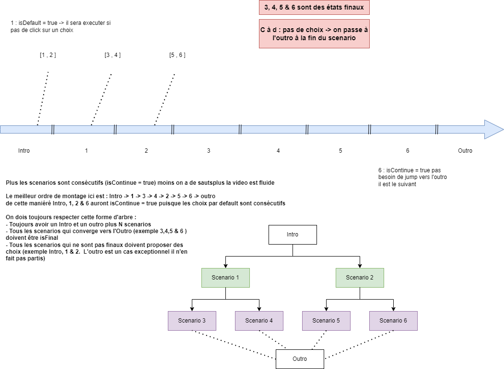

This is a [Next.js](https://nextjs.org/) project bootstrapped with [`create-next-app`](https://github.com/vercel/next.js/tree/canary/packages/create-next-app).

## Getting Started

* We assume that node is already installed (otherwise download and install : https://nodejs.org/en/download/)

1 - execute the **compile.bat** file only the first time you download the project or when a new version is provided

2 - execute the **run.bat** to run the server (you have to stop/start **every time** you change the settings under the **data** Folder)

3 - open http://localhost:3000/ in the browser after the server is running

## Explanation



## Settings

the most important changes must be done under the data Folder (**settings.json** and **scenaries.json**)

### scenaries.json

Here we defined all the possible scenarios that constitutes our video (like in the screenshot under Explanation)

```json
{"6": { //ScenarioId = id of the scenario => will be user later in setting.json to point to the scenario
        "text": "Scenario 6", //Scenario Name which is also the button text if it can be choosed
        "startTime": 90, // when the scenario beginns
        "endTime": 120, // when the scenario ends
        "isFinal": true, // it is a final scenario = last scene before displaying the outro
        "isContinue": true // the next default scenario is consecutif to this one
    }
}
```

### settings.json

```json
{"35": { // the time in which the choice button will be displayed to the user
        "choix1": "5", // the first button representing the scenario (scenarioID defined in the scenarios.json)
        "choix2": "6", // the second button
        "choiceMaxTime": 10, // how much time the user have before making a choice
        "default": "choix1" // if the choice time is over this scenario/choice will be executed
    }
}
```
